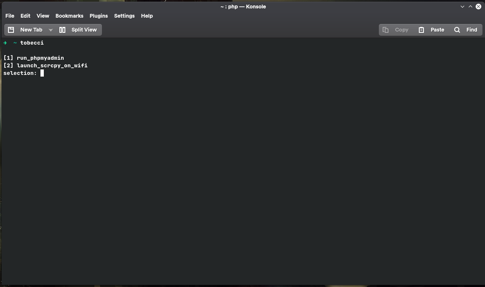

# System scripts

## Description

Handle some automation on my personal workstation

## Example: launching scrcpy on wifi

## Installation

* clone repo
* add the project's directory path to your `PATH` variable
* make the `tobecci` file executable
* launch a new terminal session and type `tobecci`

## How to extend

you can add your own `menu items` by

* adding a method to the `Menu.php` file (added functions are automatically included in the menu)  
* then write (inside your method) the code to be executed
* the `Command.php` file already has some helper functions(for running shell commands), feel free to use them